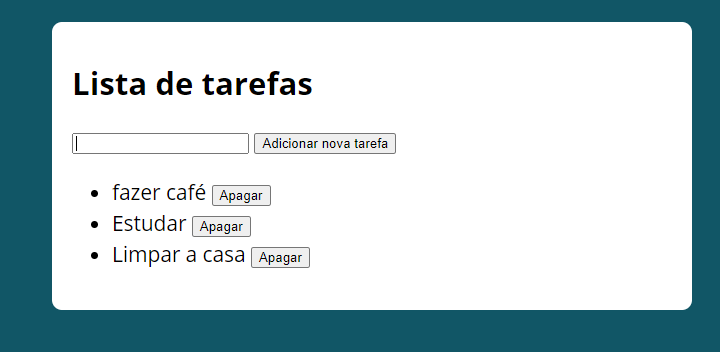

# lista_de_tarefas
Esse projeto utiliza JavaScript para simular uma lista de tarefas.

## Minha aplicação:

## Sobre a aplicação:

O sistema usa JavaScript para criar uma lista de tarefas com a funcionalidade apagar em cada tarefa,
a aplicação também usa os recursos do localStorage para salvar todas as tarefas criadas, fazendo com que o
usuário ao fechar o sistema não perca suas atividades.

## Por que essa aplicação?

O algoritmo do sistema foi ensinado em um workshop pela empresa b7web, contruí essa aplicação para desenvolver 
minha lógica de programação e meu portfólio pessoal.

Ficaria feliz com feedbacks:

E-mail: raphaeldesousalm@gmail.com  
Linkdin: https://www.linkedin.com/in/raphaellima98/
